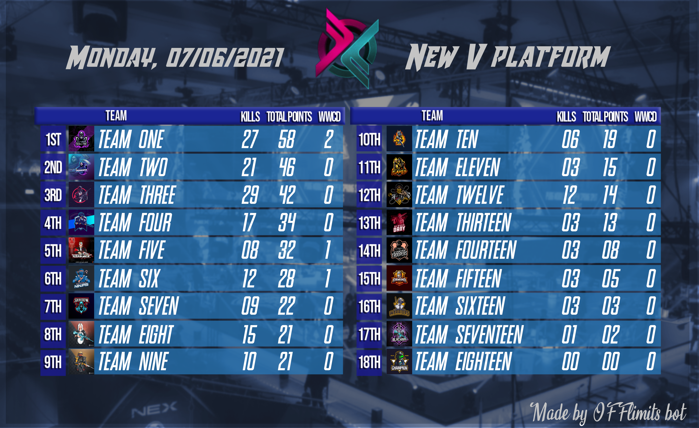
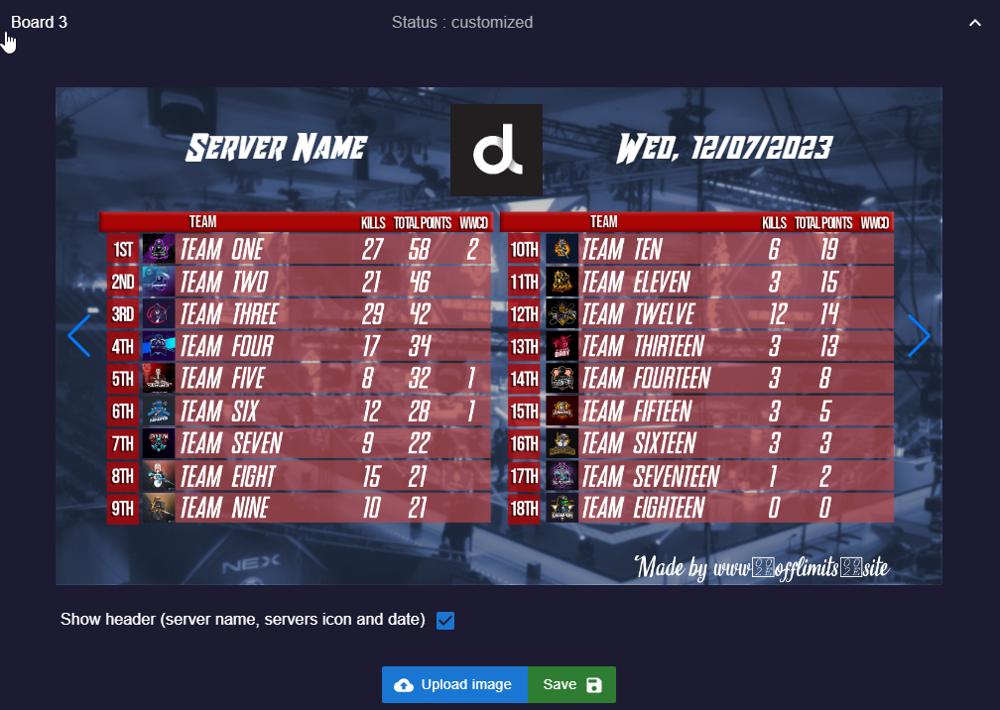

# Board

This page demonstrates how to use [OFFlimits bot](https://discord.com/oauth2/authorize?client_id=728332591790293044&scope=bot+applications.commands&permissions=268445752&client_id=728332591790293044) to generate amazing results layouts.

## About

Board is a slash command that generates beautiful leaderboard designs and images

## Requirements

Before using the command you have to setup OFFlimits bot in your
server, and to do that you need to use the command [setup](/guide/setup), which will create 2 channels:

<DiscordMessage :bot="true" profile="bot">
			<template #interactions>
				<DiscordInteraction profile="test" :command="true">setup</DiscordInteraction>
			</template>
✅ | Created <DiscordMention type="channel">results-bot</DiscordMention>
</DiscordMessage>
<DiscordMessage :bot="true" profile="bot">
✅ | Created <DiscordMention type="channel">operations</DiscordMention>
</DiscordMessage>

If you already have these channels you can skip [setup](/guide/setup).

::: tip
Before using board, you need to calculate results, otherwise board will no be generated.
:::

To find out how to calculate results please read guide on [/results](/guide/results).

## Board Templates

There are 7 board templates:

### Board 1 & 2

:::: code-group
::: code-group-item One 1
```txt:no-line-numbers               RESULTS LEADERBOARD               
   #         name        total   wins   KP   PP  
                                                 
  1.    team-one            58      2   27   31  
  2.    team-two            46      0   21   25  
  3.    team-three          42      0   29   13  
  4.    team-four           34      0   17   17  
  5.    team-five           32      1    8   24  
  6.    team-six            28      1   12   16  
  7.    team-seven          22      0    9   13  
  8.    team-eight          21      0   15    6  
  9.    team-nine           21      0   10   11  
  10.   team-ten            19      0    6   13  
  11.   team-eleven         15      0    3   12  
  12.   team-twelve         14      0   12    2  
  13.   team-thirteen       13      0    3   10  
  14.   team-fourteen        8      0    3    5  
  15.   team-fifteen         5      0    3    2  
  16.   team-sixteen         3      0    3    0  
  17.   team-seventeen       2      0    1    1  
  18.   team-eighteen        0      0    0    0  
```
:::
::: code-group-item Two 2
```txt:no-line-numbers
.-----------------------------------------------.
|              RESULTS LEADERBOARD              |
|-----------------------------------------------|
|  #  |      name      | total | wins | KP | PP |
|-----|----------------|-------|------|----|----|
| 1.  | team-one       |    58 |    2 | 27 | 31 |
| 2.  | team-two       |    46 |    0 | 21 | 25 |
| 3.  | team-three     |    42 |    0 | 29 | 13 |
| 4.  | team-four      |    34 |    0 | 17 | 17 |
| 5.  | team-five      |    32 |    1 |  8 | 24 |
| 6.  | team-six       |    28 |    1 | 12 | 16 |
| 7.  | team-seven     |    22 |    0 |  9 | 13 |
| 8.  | team-eight     |    21 |    0 | 15 |  6 |
| 9.  | team-nine      |    21 |    0 | 10 | 11 |
| 10. | team-ten       |    19 |    0 |  6 | 13 |
| 11. | team-eleven    |    15 |    0 |  3 | 12 |
| 12. | team-twelve    |    14 |    0 | 12 |  2 |
| 13. | team-thirteen  |    13 |    0 |  3 | 10 |
| 14. | team-fourteen  |     8 |    0 |  3 |  5 |
| 15. | team-fifteen   |     5 |    0 |  3 |  2 |
| 16. | team-sixteen   |     3 |    0 |  3 |  0 |
| 17. | team-seventeen |     2 |    0 |  1 |  1 |
| 18. | team-eighteen  |     0 |    0 |  0 |  0 |
'-----------------------------------------------'
```
:::
::::

### Board 3

- Board 3 is a png image leaderboard that contain 18 teams and total statistics for kills, total points and total wins.
- To enter team logos please read a guide on [logo](/guide/logo).
  


- Board 3 can be customized ( background, grid layout and which points to show ) from the [dashboard](https://offlimitsbot.com/dashboard).



Use the check boxes to control which points to show.