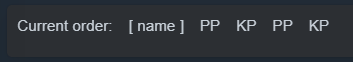
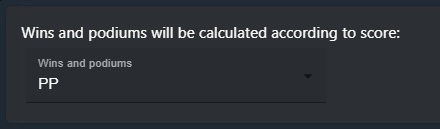
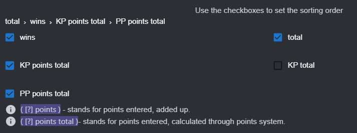
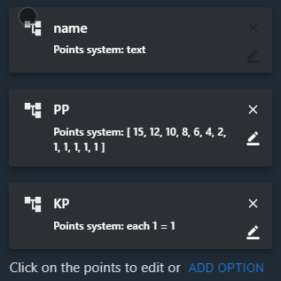

# Points system

This page demonstrates how to set a custom points system for [OFFlimits bot](https://discord.com/oauth2/authorize?client_id=728332591790293044&scope=bot+applications.commands&permissions=268445752&client_id=728332591790293044) results calculation.

## About

This feature allows you to create a custom points system to calculate the results the way you want.

## Usage

::: warning Note
Points system was moved to the [dashboard](https://offlimitsbot.com/dashboard).
:::

- Head to the [dashboard](https://offlimitsbot.com/dashboard).
- Login with your discord account.
- Select your server from the sidebar.
- Select points system settings.

### Current order

This will show you the order of points you need to input in your results channel according to your points system.

### wins and podiums

Select the points according to which the bot should calculate wins and podiums... meaning if player scores 1, it will be treated as a win.

### sorting order

According to this, the bot is going to sort your results 1st, 2nd, 3rd and so on. Use the check boxes to control the order. You can use clear button to start over.

**Notes:**

- **Something points** - refers to the sum of the ( something ) you enter.
- **Something points total** - refers to the total of ( something ) calculated by the points system.

**Example:**

> For a game, players get 2 points per fast lap:
> 
> One of the players played 3 games and scored a fast lap in each game
> 
> fast lap points = 3;
> 
> fast lap points total = 6;  

### points inputs

Use this to create and edit the points system.

Click on it to open editing options. Click on the x to delete it

Click add option to create a new points option

::: tip
The option name can not be edited or deleted.
:::

Don't forget to save after you setup everything.