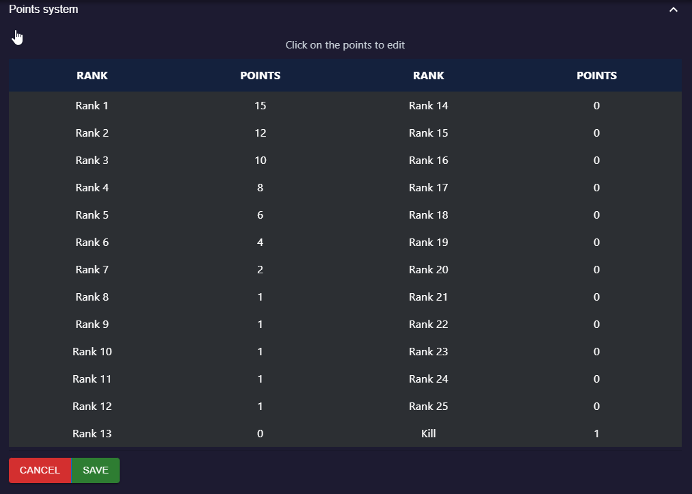

# Points system

This page demonstrates how to set a custom points system for [OFFlimits bot](https://discord.com/oauth2/authorize?client_id=728332591790293044&scope=bot+applications.commands&permissions=268445752&client_id=728332591790293044) results calculation.

# About

This feature allows you to create a custom points system to calculate the results the way you want.

# Usage

::: warning Note
Points system was moved to the [dashboard](https://offlimitsbot.com/dashboard).
:::

- Head to the [dashboard](https://offlimitsbot.com/dashboard).
- Login with your discord account.
- Select your server from the sidebar.
- Select points system settings.

- Click on numbers to edit.
